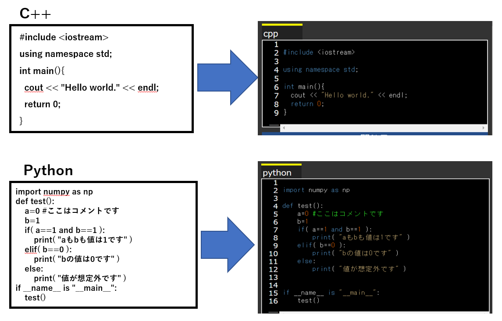

こんな感じで、C++やPython、Javaなどのプログラムにシンタックスハイライトを施し、HTML形式に変更する。


example:
```sh
$ cd example
$ python3 main.py
```
上のコマンドを実行すると、`output.html`と`output_simple_html`が生成される。それぞれ`example.cpp`を読み込んで、それに色づけを行っている。

配色の設定はcolor_setting.xmlで行う。

